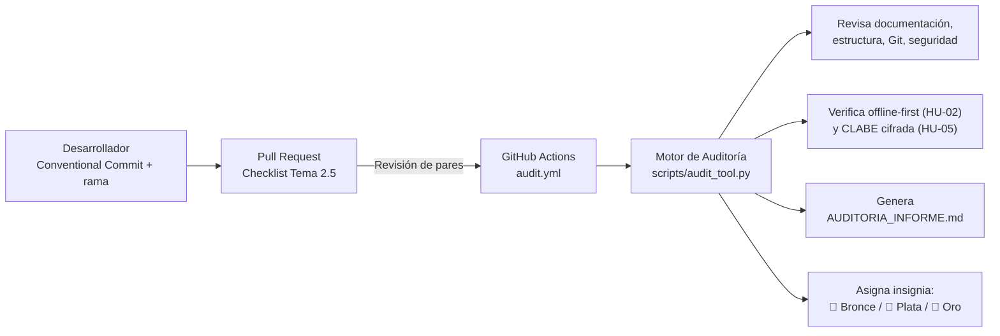

# Lista de Verificación, Sistema de Insignias y Auditoría Automatizada (Grupo 7)

## Adaptación de MoProSoft a GitHub para el proyecto de trazabilidad textil (TisaaSavi)


> **Institución:** Instituto Tecnológico de Tlaxiaco (TecNM)
> **Carrera:** Ingeniería en Sistemas Computacionales
> **Asignatura:** Gestión de Proyectos de Software
> **Tema:** 2.5 Estándares Básicos de Control de Cambios y Auditoría de Configuración
> **Equipo evaluado:** Grupo 7
> **Repositorio oficial:** `gestion-de-proyectos-de-software-lista-de-verificacion-group-7`

---

## Resumen y propósito del repositorio

Este repositorio contiene la solución para el Tema 2.5 (Control de Cambios y Auditoría de Configuración), aplicada al proyecto de trazabilidad textil para vendedores-tejedores de Santo Tomás Ocotepec (backlog: HU-01 Autenticación OTP, HU-02 Registro offline, HU-03 Certificación en Testnet, HU-04 Consulta pública por QR, HU-05 Retribución con CLABE cifrada).

La herramienta adapta MoProSoft (categorías Operación y Gerencia) a primitivas reales de GitHub — plantillas de Pull Request e Issue, un workflow de GitHub Actions y un motor de auditoría en Python — considerando de forma explícita la conectividad limitada e intermitente de la región Mixteca y la protección de los datos de pago (CLABE) de las tejedoras.



---

## Estado real de la auditoría

**Resultado de la última ejecución del workflow (`.github/workflows/audit.yml`):** 16 de 17 criterios cumplidos — **94.1% → 🥈 Insignia Plata**.

### Brecha declarada

| Criterio | Resultado | Causa raíz |
|---|---|---|
| GIT-03 — Los commits siguen Conventional Commits | FAIL | Varios commits se generaron automáticamente por la interfaz web de GitHub al subir archivos (ej. *"Add pull request template for contributions"*), sin el prefijo `feat:`/`docs:`/`fix:` que exige la convención. |

**Por qué no se corrigió artificialmente:** el equipo decidió declarar esta brecha en vez de crear commits vacíos solo para inflar el porcentaje a Oro. El objetivo del auditor es medir disciplina real de control de cambios, no maquillar un número. A partir de este punto, todo commit nuevo del equipo seguirá el formato `feat:`/`fix:`/`docs:`/`test:`/`refactor:`/`chore:`, y se espera que el porcentaje suba de forma orgánica conforme el historial de commits recientes cumpla la convención.

---

## Cobertura de la rúbrica de evaluación

| Criterio / Indicador de alcance | Ponderación | Documento clave | Cómo se cumple |
|---|---|---|---|
| **Indicador C — Creatividad y propuesta del sistema de insignias y auditoría** | 50% | [`docs/SISTEMA_INSIGNIAS.md`](docs/SISTEMA_INSIGNIAS.md), [`docs/LISTA_DE_VERIFICACION.md`](docs/LISTA_DE_VERIFICACION.md), [`.github/PULL_REQUEST_TEMPLATE.md`](.github/PULL_REQUEST_TEMPLATE.md) | Checklist por fases (CK-1.x a CK-4.x) ligada a las 5 historias reales del backlog, con insignias alineadas a las bandas oficiales de desempeño del TecNM |
| **Indicador A — Adaptación a situaciones y contextos complejos** | 25% | [`docs/ADAPTACION_MOPROSOFT.md`](docs/ADAPTACION_MOPROSOFT.md), [`scripts/audit_tool.py`](scripts/audit_tool.py), [`.github/workflows/audit.yml`](.github/workflows/audit.yml) | Traducción de MoProSoft a GitHub, con verificaciones automáticas de conectividad limitada (offline-first) y protección de datos de pago (CLABE) |
| **Indicadores E y F — Integración interdisciplinaria y trabajo autónomo** | 25% | [`AUDITORIA_INFORME.md`](AUDITORIA_INFORME.md) | El motor de auditoría se ejecuta de forma autónoma sobre el propio repositorio; el resultado real (94.1%, Plata) queda documentado con honestidad académica, incluyendo la brecha encontrada |

---

## Estructura del repositorio

.
├── .github/
│ ├── workflows/
│ │ └── audit.yml # Pipeline de CI que ejecuta la auditoría
│ ├── ISSUE_TEMPLATE/
│ │ ├── bug_report.md # Plantilla de reporte de defectos
│ │ └── feature_request.md # Plantilla de historia de usuario
│ └── PULL_REQUEST_TEMPLATE.md # Checklist de control de cambios (Tema 2.5)
├── docs/
│ ├── SISTEMA_INSIGNIAS.md # Especificación de insignias Bronce/Plata/Oro
│ ├── ADAPTACION_MOPROSOFT.md # Adaptación de MoProSoft a GitHub
│ └── LISTA_DE_VERIFICACION.md # Checklist maestra en 4 fases
├── scripts/
│ └── audit_tool.py # Motor de auditoría automatizada (Python)
├── AUDITORIA_INFORME.md # Resultado real, generado por el script
├── LICENSE # Licencia MIT
└── README.md # Este archivo


---

## Ejecución local de la auditoría

```bash
# 1. Clonar el repositorio
git clone https://github.com/SistemasTecTlaxiaco/gestion-de-proyectos-de-software-lista-de-verificacion-group-7.git
cd gestion-de-proyectos-de-software-lista-de-verificacion-group-7

# 2. Ejecutar la auditoría (Python 3)
python scripts/audit_tool.py

# 3. Consultar el dictamen generado
cat AUDITORIA_INFORME.md
```

El workflow `.github/workflows/audit.yml` ejecuta este mismo script automáticamente en cada `push` y cada Pull Request contra `main`.

---

## Créditos institucionales

- **Instituto:** Instituto Tecnológico de Tlaxiaco (TecNM)
- **Materia:** Gestión de Proyectos de Software
- **Equipo:** Grupo 7
- **Ubicación:** Heroica Ciudad de Tlaxiaco, Oaxaca, México
